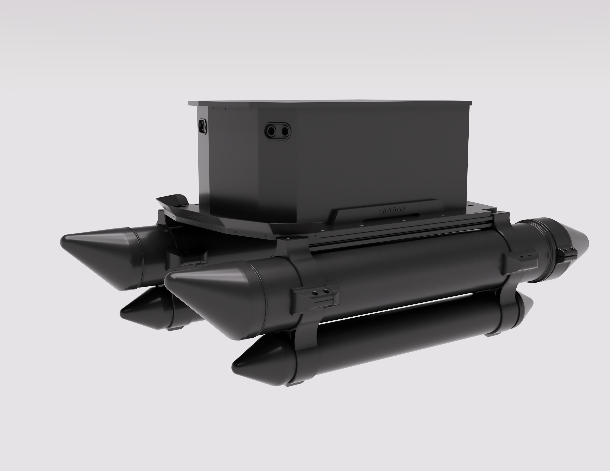

# SEEKR — DIY Autonomous Water Mapping Platform

**SEEKR** is a DIY autonomous water platform designed for lake mapping, underwater search, inspection, environmental data collection and future AI-based object identification.

The project combines **3D printing, CNC machining, waterproof electronics, GPS, sonar, cameras, sensors and open-source autopilot software** to explore how far an individual maker can push accessible desktop manufacturing.

---

## Project Vision

The long-term goal of SEEKR is to become a modular autonomous boat that can scan lakes, ponds, harbors and coastal areas, collect useful data, and help visualize what is under the surface.

Possible future use cases include:

- 3D mapping of lakes and underwater terrain
- Finding lost objects underwater
- Dock, bridge and shoreline inspection
- Environmental and water quality data collection
- Debris detection
- Search and rescue support
- AI-based object identification
- Obstacle avoidance for safer autonomous operation

The goal is not just to build a remote-controlled boat, but to create a flexible maker-built platform for real-world water exploration.

---

## Why I’m Building This

This project started as a simple but ambitious idea:  
I wanted to build my own autonomous boat from scratch.

Not by buying a finished system, but by designing, printing, machining, wiring, testing and improving as much as possible myself.

At first, it was mainly a maker challenge. Could I create a floating platform using the tools I already had? Could I combine 3D printing, CNC machining, electronics, GPS, radio control, sensors and open-source autopilot software into something that actually works on water?

But the deeper I got into the project, the more it became something bigger than a remote-controlled boat. It became a real engineering challenge involving buoyancy, waterproofing, vibration, propulsion, motor mounts, electronics protection, cable routing, GPS placement, battery weight, navigation lights, sensor integration and real-world testing.

---

## Current Status

The physical platform is currently under development.

Completed or in progress:

- Main floating platform
- Motor mounting concept
- Electronics enclosure concept
- Navigation light placement
- Rear mast concept for GPS, antenna and visibility equipment
- 3D printed brackets and prototype parts
- CNC-cut structural parts
- Buoyancy testing and improvements
- GPS and radio control planning
- ArduPilot / ArduRover research and setup planning

The project is still evolving through real-world testing, redesign and iteration.

---

## 3D Printing in the Project

3D printing is one of the most important tools in this project.

My **Bambu Lab X1 Carbon** has almost **3,400 hours of print time** and has been a central part of the development process. It has allowed me to rapidly design, test and improve functional parts for the boat.

Printed parts are used or planned for:

- Motor mounts
- Sensor housings
- GPS and antenna mounts
- Cable routing
- Waterproof covers
- Mast components
- Electronics brackets
- Test fixtures
- Modular sensor attachments
- Buoyancy-related mounts

This project is a good example of how 3D printing can be used as a serious engineering tool, not just for decorative parts or simple prototypes.

---

## Materials

The next stage of the project requires stronger engineering materials.

Planned materials include:

- PA-CF
- PA6-CF
- PAHT-CF
- PET-CF
- ASA
- TPU
- Nylon-based materials

The boat operates in a harsh environment where parts are exposed to water, vibration, load, UV, temperature changes and mechanical stress. Stronger materials will make the platform more reliable and suitable for real-world testing.

---

## Future Capabilities

### Sonar and 3D Mapping

One of the main goals is to combine GPS and sonar to create depth maps and eventually 3D models of lake bottoms and underwater terrain.

This could be useful for:

- Mapping small lakes
- Locating drop-offs
- Finding submerged structures
- Creating safer routes for boats
- Inspecting underwater areas
- Supporting search operations

### Underwater Search

SEEKR could eventually help search for lost objects underwater, such as:

- Tools
- Phones
- Anchors
- Fishing gear
- Drones
- Boat parts
- Other valuable objects

Instead of searching randomly, the boat could scan a defined area systematically and mark GPS positions where something unusual appears.

### AI Object Identification and Obstacle Avoidance

A future goal is to add cameras and multiple sensors for AI-based object identification and obstacle avoidance.

The boat could eventually detect:

- Floating debris
- Buoys
- Rocks
- Docks
- Boats
- Shoreline structures
- Lost objects
- Obstacles in its path

This would make the platform more useful for mapping, inspection and search-related missions.

---

## Roadmap

### Stage 1 — Physical Platform

- Improve buoyancy
- Improve waterproofing
- Finalize electronics enclosure
- Improve motor mounting
- Improve cable routing
- Build rear mast for GPS, antenna and lights

### Stage 2 — Stronger Materials

- Replace prototype parts with engineering-material prints
- Test PA-CF, PET-CF, ASA and nylon-based materials
- Improve vibration resistance
- Improve strength and serviceability

### Stage 3 — Autonomous Navigation

- Integrate GPS and compass
- Configure telemetry
- Set up radio control
- Test ArduPilot / ArduRover
- Add failsafe behavior
- Test autonomous route following

### Stage 4 — Sonar and Mapping

- Add sonar hardware
- Log depth data
- Combine GPS and sonar data
- Generate depth maps
- Explore 3D lake-bottom visualization

### Stage 5 — Cameras and AI

- Add waterproof camera modules
- Add lighting
- Test onboard processing
- Experiment with AI object identification
- Test obstacle avoidance concepts

### Stage 6 — Documentation

- Build logs
- Photos and videos
- CAD progress
- 3D printing iterations
- CNC work
- Electronics documentation
- Test results
- Failures and improvements

---

## Tools and Technologies

Planned and current tools include:

- Fusion 360
- Bambu Lab X1 Carbon
- CNC machining
- 3D printing with engineering materials
- ArduPilot / ArduRover
- GPS and compass modules
- ELRS / radio control
- Telemetry
- Sonar
- Cameras
- Sensors
- Waterproof electronics
- Python / data processing
- Real-world lake testing

---

## Why This Project Matters

SEEKR is an attempt to prove that advanced autonomous marine robotics does not have to be limited to large companies, universities or expensive commercial systems.

With accessible tools, persistence and creativity, individual makers can build serious functional machines too.

This project is practical, experimental, challenging, useful and a little bit crazy in the best possible way.

---

## Documentation Status

This repository is currently being created as the public documentation space for SEEKR.

More photos, CAD files, electronics diagrams, build logs, test results and videos will be added as the project develops.
